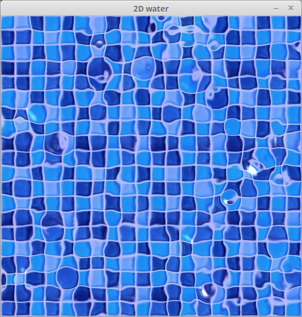
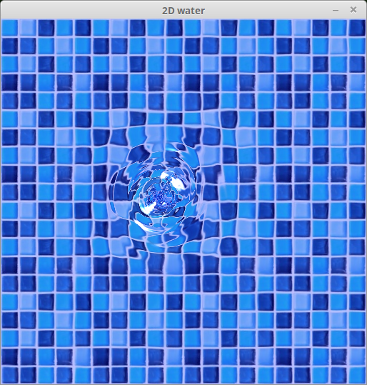
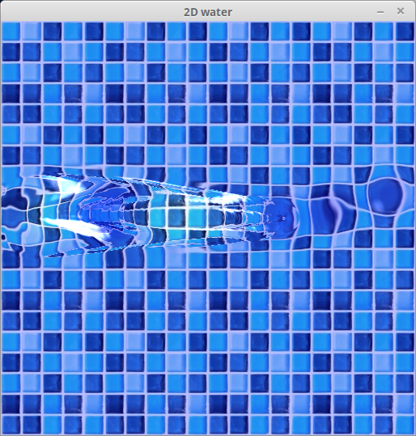
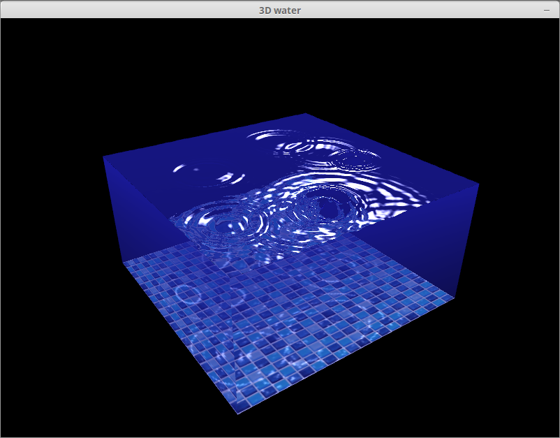
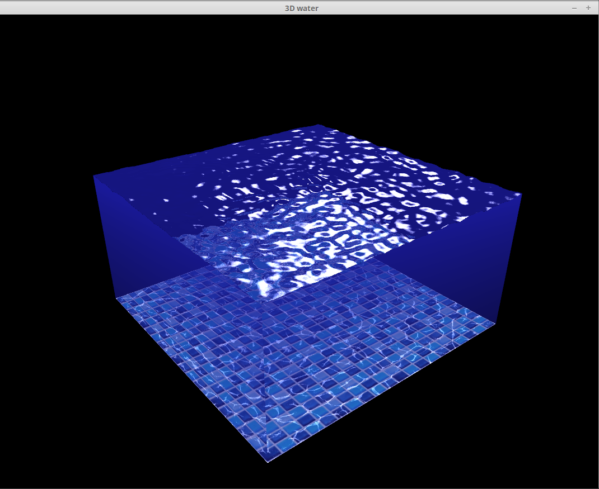
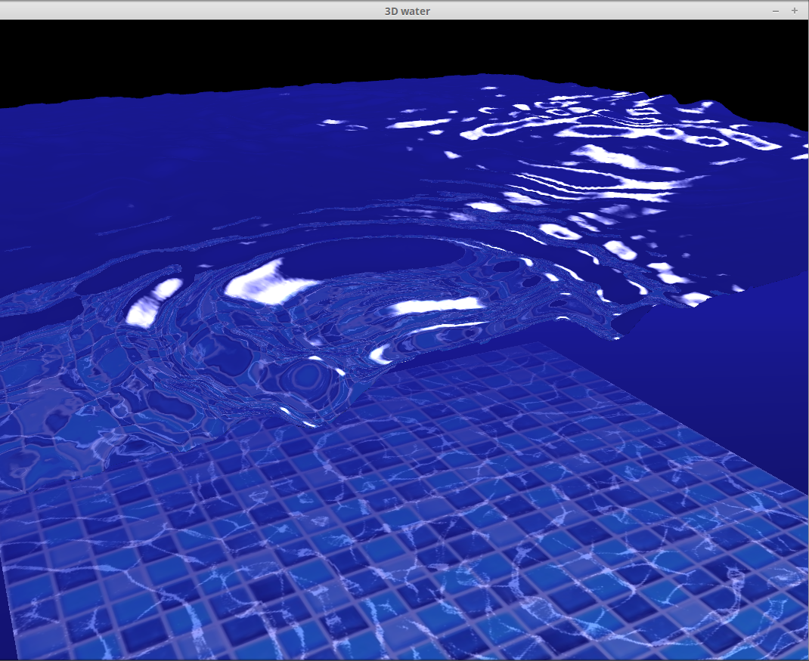

# water-simulation-gpu
Interactive water simulation running on GPU, using C++, SFML, OpenGL shaders.

# Usage
On the 2D render window:
You can interact with the water with left mouse button.
Press R to reset the simulation.

On the 3D render window:
You can rotate camera window left mouse button.
You can zoom/unzoom with mouse wheel.

The 3D rendering takes a lot of resources, you can disable it by commenting the #define DISPLAY3D line on top of the main.cpp.

On my integrated Intel chip, the simulation runs at 1000 fps with only the 2D rendering, and at 350 fps with both 2D and 3D rendering.

# Screenshots

# Algorithm

## Simulation
The water surface is subdivided into a grid. It is stored in a sf::Texture (FBO), each pixel mapping to a grid cell.

A cell holds two informations:
* vertical position: stored in red and green channels
* vertical velocity: stored in blue and alpha channels

Each feature is stored in 2 pixel channels for better precision: 2 channels can store 256*256 = 65536 values. This complexifies a bit the reading of position and velocity, thus it is only used for simulation. For rendering, I first create a simplified heightmap, smaller and faster to read.

Since it is not allowed to read and write to the same texture at the same time, I need to have 2 buffers used alternatively as last step (reading) and current step (writing).

Each node is influenced by three forces:
* "vertical spring": each node tends to come back to the mid-height level
* surface tension: a node tries to align itself with its four immediate neighbours
* friction: constant multiplicative factor applied to velocity, lesser than 1, so that the water stops moving eventually

## Rendering
The rendering part has many visual parameters:
* waves amplitude
* average water level
* water color
* refraction factor
* maximum view distance underwater
* light direction (for specularity)

For rendering I use a simplified heightmap:
* RGB channels store the cell's normal, assuming an amplitude of 1
* A channel stores the relative height, assuming an amplitude of 1

Adjusting this data to the actual amplitude is doable with a simple scaling.

### 2D rendering
The rendering of the 2D scene does not involve any geometry.
It is only normal mapping.
Given a cell's height and normal, it is easy to compute the refracted light ray and then where to sample the ground texture.

### 3D rendering
The 3D rendering involves geometry, normal mapping, specularity, refraction, water opacity computation, Fresnel coefficients computation. Thus is quite computation intensive, more than the simulation itself.

The water is displayed in the cube [0,1]x[0,1]x[0,1].
Position (x,y,z) corresponds to the sample (x,y) of the heightmap.
The rendering of the 3D scene is done in 2 steps.

#### Surface rendering
The surface rendering uses both geometry and normal mapping.
Surface is sent as a grid of vertically aligned vertices.

The vertex shader reads the heightmap and adjusts their height.

The fragment shader then does the normal mapping.

#### Cube sides rendering
The cube sides a sent with a height of 1.
To make them fit the surface geometry, the fragment shader simply discards any fragment higher than the height read on the heightmap.
 
# COMPILATION
This project expects SFML 2.3.2 to be installed on the machine.
It also requires at least OpenGL 3.0 with support for shaders.

